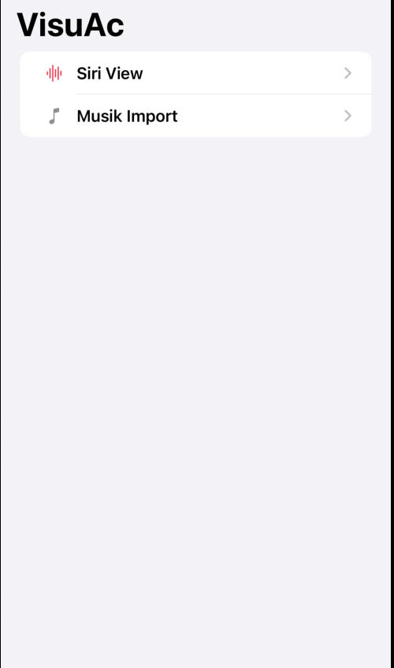
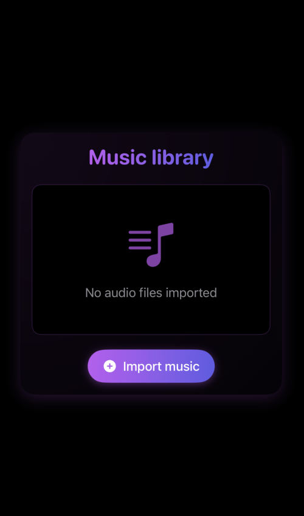
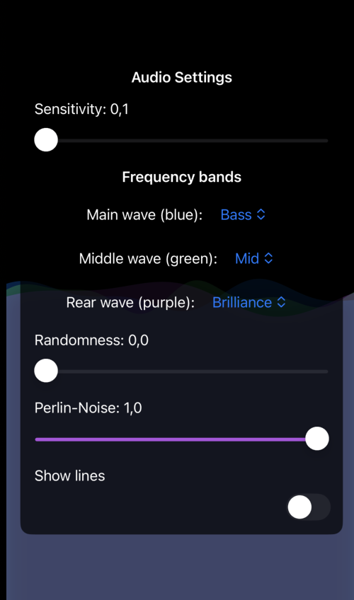

# VisuAc

VisuAc is a SiriWave-like music visualizer built with SwiftUI. Currently, it supports importing your own music, but it is not yet saved to the app. The visualizer sometimes does not respond accurately to the music being played.

## Issues

- **High CPU Usage & Battery Drain**: The app experiences significant CPU usage, which leads to a fast battery drain.
  
- **Audio Import Limitation**: Audio can only be imported while in the Import View. If you navigate away from this view, the audio needs to be imported again if you want to select different tracks.
  
- **Visualizer Accuracy**: The music visualizer does not always react accurately to the music being played.

## Screenshots

1. **Home Screen**: The main screen where you can interact with the app, navigate to different sections, and start the audio visualizer.
  
2. **Music Import**: The screen where you can import your own music. Currently, audio needs to be re-imported every time you exit the Import View.
  
3. **Visualizer**: The screen that displays the music visualizer in action. However, as mentioned, the visualizer's response to music can sometimes be imperfect.

4. **WaveView Settings**: The screen where you can customize the settings for the WaveView. This allows you to adjust various visual settings for the music visualizer.

## WavePreview

<!-- Screenshots nebeneinander -->

  
  
  
  

## Check out the Player in Action

You can also watch a demo of the player in action on **X.com**:  
[Watch the demo](https://x.com/0x1585D65F0/status/1903976480876396843)
